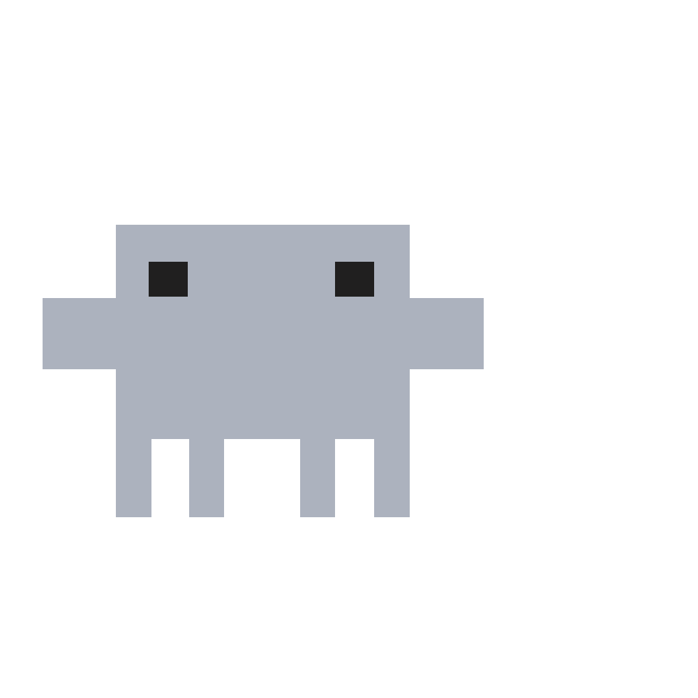

# gitccino personal site

Showing the real me, without the overselling but overengineering

## Stack


## Repository layout

```text
apps/
  web/          Vite frontend
  api/          Bun and Elysia API workspace
infra/
  sst/          SST infrastructure
  terraform/    Terraform infrastructure
```

## Commands

```sh
bun install
bun run dev
bun run dev:api
```
